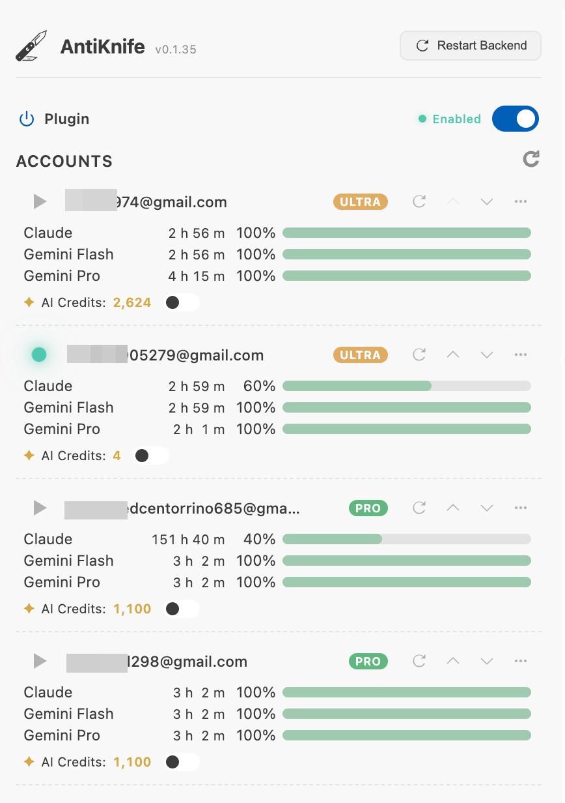
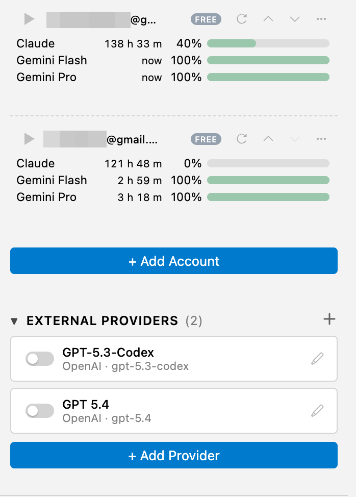
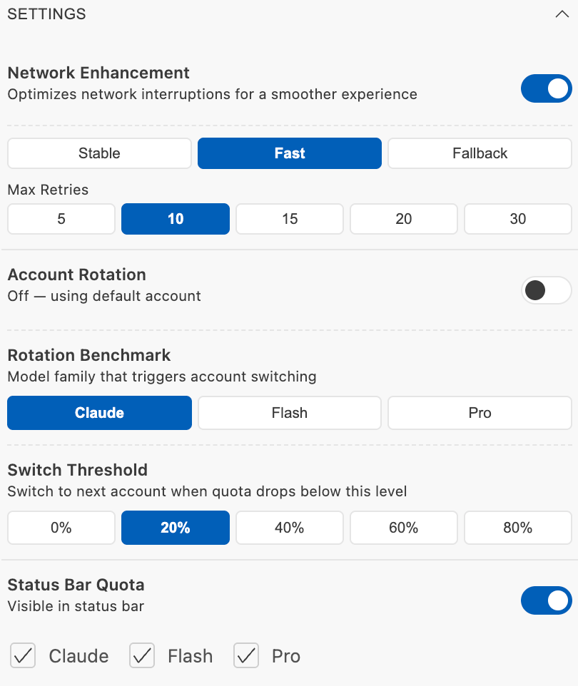
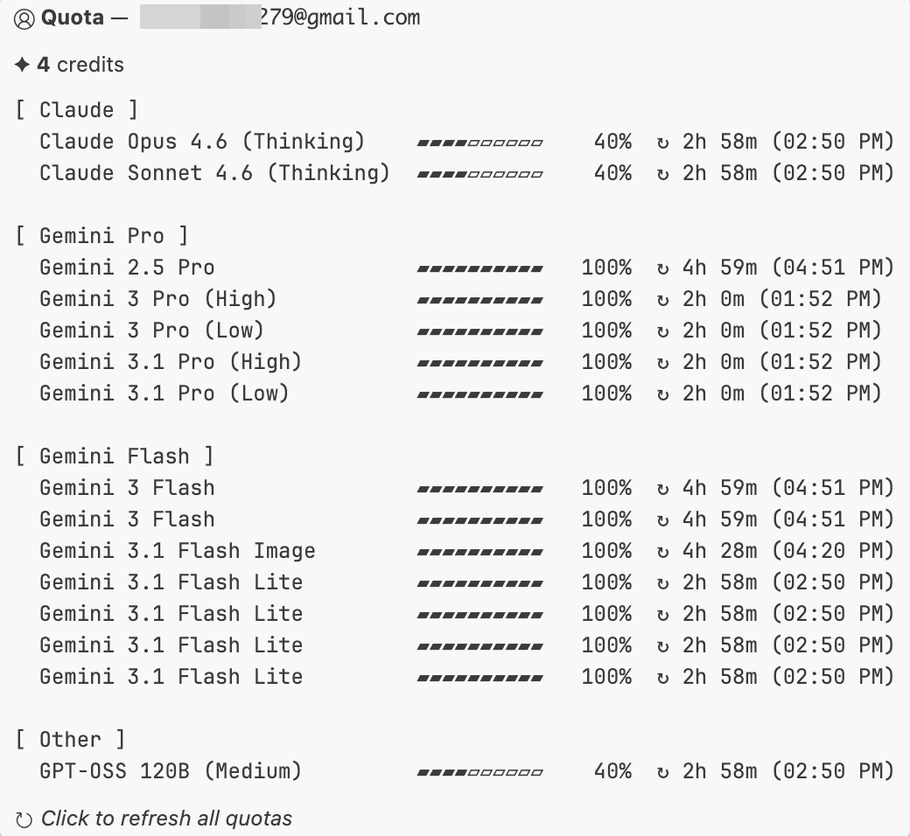
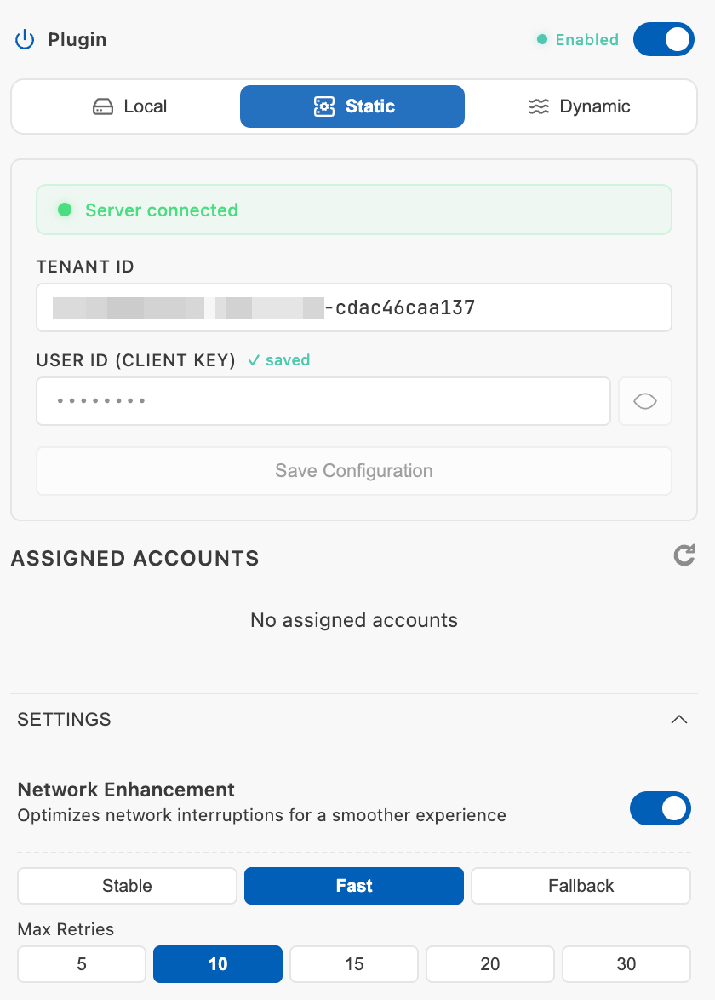

<p align="center">
  
</p>

<h1 align="center">AntiKnife</h1>

<p align="center">
  <strong>Multi-account manager and network optimizer for Antigravity IDE</strong><br>
  Seamlessly rotate between Google accounts with zero interruption. Rock-solid streaming connections out of the box.
</p>

<p align="center">
  <a href="README.zh-CN.md">中文</a> | <strong>English</strong>
</p>

<p align="center">
  <a href="https://open-vsx.org/extension/ace/antiknife">
    
  </a>
  <a href="https://github.com/ace-express/antiknife/issues">
    
  </a>
  <a href="LICENSE">
    
  </a>
</p>

---

## Highlights

1. **Seamless Account Switching** -- Switch between Google accounts instantly with zero IDE restart. When your current account's quota runs low, AntiKnife automatically rotates to the next one in your pool to keep your workflow uninterrupted.
2. **External LLM Providers** -- Bring your own API key and connect any OpenAI-compatible LLM provider. Use GPT, DeepSeek, or any third-party model alongside your Google accounts, all managed from one unified panel.
3. **Network Enhancement** -- A built-in streaming proxy engineered to eliminate EOF drops and mid-stream disconnects. Fine-tune connection strategies to maintain rock-solid stability, even behind restrictive firewalls.
4. **Real-Time Quota Monitoring** -- Live quota tracking across all model families (Claude, Gemini Pro, Gemini Flash) displayed directly in the status bar, with per-model progress bars, color-coded alerts, and reset countdowns.
5. **Team Authorization** -- Distribute a shared token pool across your entire team through a dedicated remote mode and admin dashboard, without ever exposing the underlying credentials.

## Features

### 1. Account Switching and Auto-Rotation

- **Zero-restart switching:** Instantly switch between multiple Google accounts without restarting the IDE.
- **Automatic rotation:** When the active account's quota drops below your configured threshold, AntiKnife silently rotates to the next available account in the pool.
- **Pool management:** Import, reorder, and enable or disable accounts with a visual drag-and-drop interface.



### 2. External LLM Providers

- **Bring your own key:** Connect any OpenAI-compatible API provider (OpenAI, DeepSeek, Groq, etc.) by simply entering an endpoint URL, API key, and model name.
- **Unified management:** Add, edit, enable, or disable external providers right alongside your Google accounts in the same sidebar panel.
- **Seamless routing:** When an external provider is active, requests are automatically routed through it -- no manual configuration changes needed.



### 3. Network Enhancement

- **Streaming proxy:** A purpose-built local proxy that intercepts and stabilizes Gemini streaming connections, significantly reducing mid-stream interruptions.
- **Connection presets:** Choose between Fast, Stable, and Legacy networking profiles, or define custom connection and heartbeat parameters to match your exact network conditions.
- **Auto-rotation integration:** Network enhancement and account rotation work together -- when a connection fails, the system retries with optimized parameters before falling back to the next account.



### 4. Real-Time Quota Display

- **Status bar integration:** See remaining quota percentages for Claude, Gemini Pro, and Gemini Flash at a glance without leaving your editor.
- **Detailed hover tooltip:** A monospace-aligned breakdown of every model's quota percentage, progress bar, and reset countdown timer.
- **Configurable thresholds:** Set the exact percentage (0% -- 80%) at which AntiKnife triggers warnings or initiates auto-rotation.



### 5. Team Authorization and Remote Mode

- **Remote server connection:** Connect to a centralized team server using a Tenant ID and Client Key. No manual token management required on the client side.
- **Admin dashboard:** Manage tokens, allocate client seats, set expiration policies, and monitor per-member usage from an integrated panel.



## Installation

### From Open VSX Registry

Search for **AntiKnife** in the extension marketplace, or install directly:
```bash
ext install ace.antiknife
```

### Manual Install

Download the `.vsix` file from [Releases](https://github.com/ace-express/antiknife/releases), then:
```bash
code --install-extension antiknife-x.x.x.vsix
```

## Getting Started

1. Install AntiKnife from the extension marketplace.
2. Click the AntiKnife icon in the activity bar to open the management panel.
3. Your IDE's current Google account is automatically imported.
4. Click **Add Account** to authorize additional Google accounts into your pool.
5. In Settings, enable **Account Rotation** for automatic switching and **Network Enhancement** for optimized streaming.

## Supported Platforms

| OS | Architecture | VSCE Target |
|----|-------------|-------------|
| macOS | Apple Silicon (ARM64) | `darwin-arm64` |
| macOS | Intel (x64) | `darwin-x64` |
| Linux | x64 | `linux-x64` |
| Linux | ARM64 | `linux-arm64` |
| Windows | x64 | `win32-x64` |
| Windows | ARM64 | `win32-arm64` |

## Requirements

- Antigravity IDE v1.85.0 or later

## Found a Bug?

Please [open an issue](https://github.com/ace-express/antiknife/issues/new?template=bug_report.md) with steps to reproduce.

## License

AntiKnife is proprietary software. See [LICENSE](LICENSE) for details.

---

<p align="center">
  Made for the Antigravity IDE community
</p>
