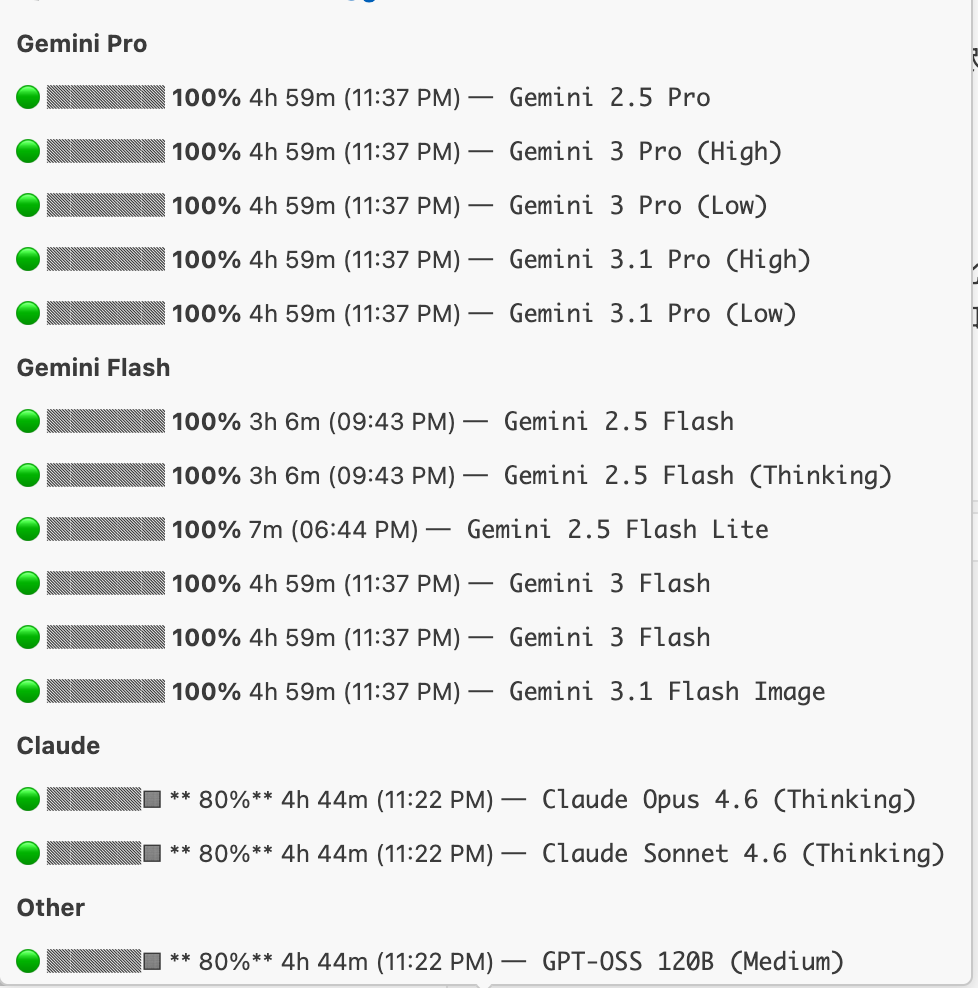
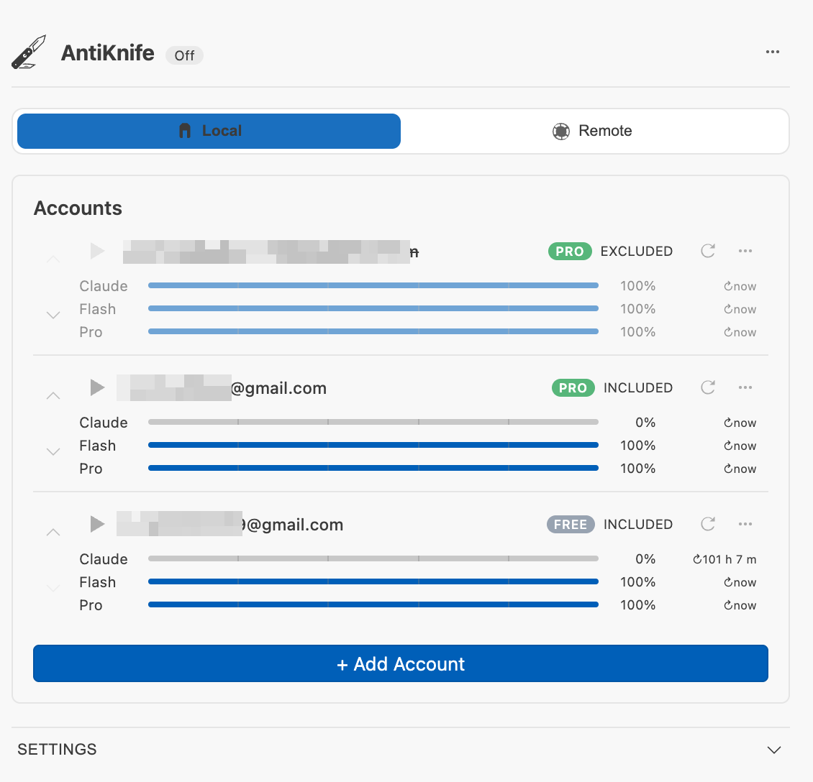
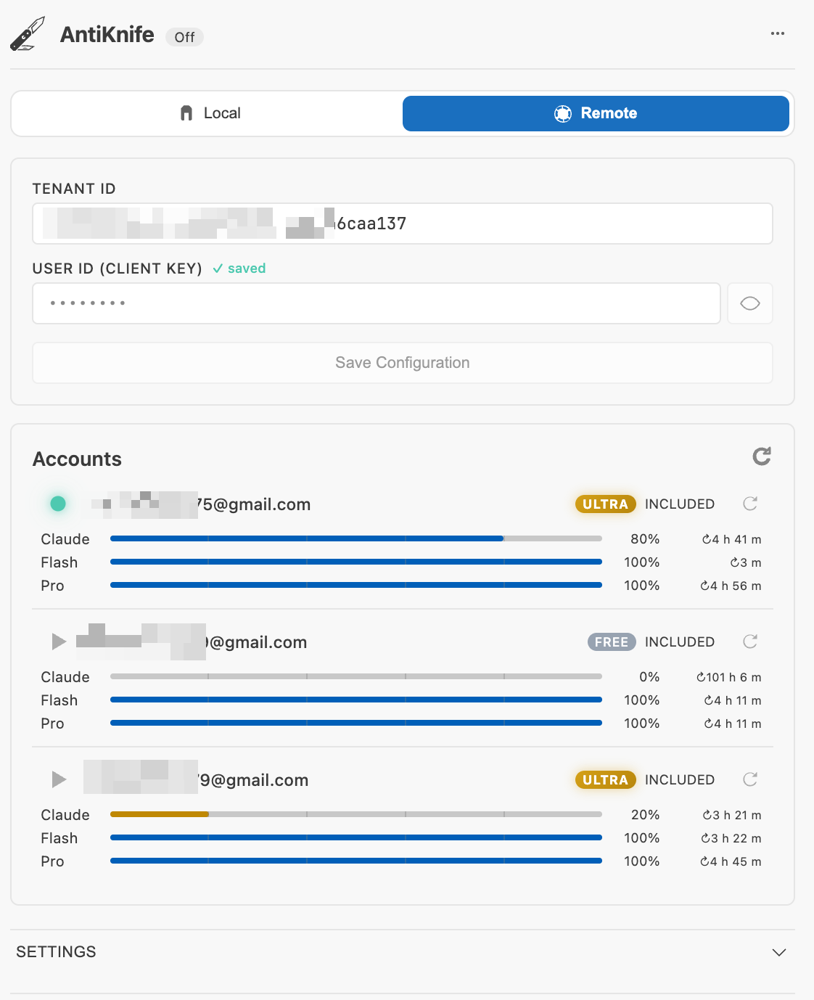
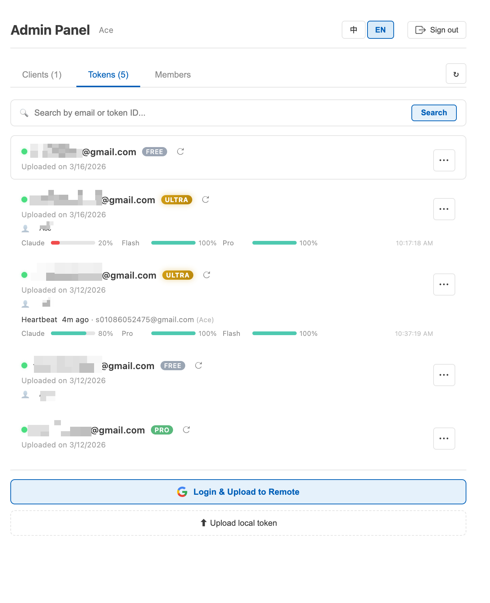

# AntiKnife

🌐 **中文** | [English](./README.md)

> Antigravity IDE 多账号管理器 — 在多个 Google 账号之间无缝轮换，零打断编码。

## ✨ 亮点

- **切换账号无需重启 IDE** — 在多个 Google 账号之间即时切换，IDE 保持运行
- **基于配额自动轮换** — 当某个账号配额不足时，AntiKnife 自动静默切换到下一个
- **实时配额监控** — 在状态栏直接查看所有模型系列的剩余配额

## 功能特性

### 🔄 自动令牌轮换
管理多个 Google 账号，当配额耗尽时 AntiKnife 自动切换到下一个账号。无需手动操作，只管写代码。

### 📊 实时配额监控
在状态栏一眼看到剩余配额。可视化指标覆盖所有模型系列（Gemini Pro、Flash、Claude），提供逐模型百分比显示、颜色预警和重置倒计时。

### 👥 多账号管理
- 通过安全的 Google OAuth2 登录流程添加账号
- 自动导入 IDE 当前已登录的账号
- 从轮换池中启用/停用单个账号
- 拖放排序账号优先级
- 一键切换到任意账号 — **无需重启 IDE**

### ⚡ 智能轮换策略
- **优先级轮换**：优先使用首选账号，配额不足时自动回退
- **分模型系列追踪**：Claude、Gemini Flash、Gemini Pro 独立配额监控
- **可配置阈值**：设置触发轮换的配额百分比（0% – 80%）
- **活跃模型基准**：选择以哪个模型系列的配额决定轮换

### 🌐 本地与远程模式
- **本地模式**：在本地管理你自己的账号，自动轮换并实时显示配额信息
- **远程模式**：连接共享服务器进行团队账号管理 — 管理员通过多租户管理面板将账号分发给团队成员

### 🔧 管理面板（远程模式）
面向团队负责人和管理员：
- 多租户组织管理
- 上传和管理共享 Google 账号（令牌）
- 创建和管理客户端席位及访问密钥
- 为客户端分配令牌并设置有效期
- 成员管理与基于角色的访问控制
- 实时客户端心跳监控
- 按账号查看配额使用报告

### 🌍 多语言界面
扩展界面（侧边栏、管理面板、命令）完整支持：
- English
- 简体中文

## 快速开始

1. 从扩展市场安装 AntiKnife
2. 点击活动栏中的 🔪 图标
3. IDE 当前登录的 Google 账号会被自动导入
4. 点击**添加账号**，使用更多 Google 账号登录
5. 在设置中开启**账号轮换**开关即可启动自动切换

## 支持平台

| 操作系统 | 架构 | VSCE 目标 |
|---------|------|----------|
| macOS | Apple Silicon (ARM64) | `darwin-arm64` |
| macOS | Intel (x64) | `darwin-x64` |
| Linux | x64 | `linux-x64` |
| Linux | ARM64 | `linux-arm64` |
| Windows | x64 | `win32-x64` |
| Windows | ARM64 | `win32-arm64` |

## 系统要求

- Antigravity IDE v1.85.0 或更高版本

## 反馈与支持

发现 Bug 或有建议？请在我们的 [GitHub 仓库](https://github.com/ace-express/antiknife/issues) 提交 Issue。

## 许可证

专有软件 — 详见 [LICENSE](./LICENSE)。
